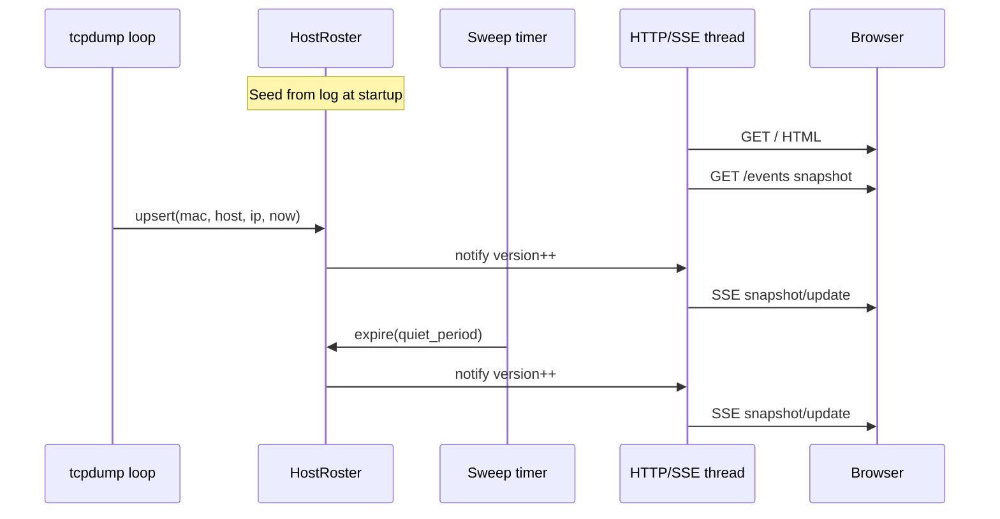

# feat: Live hosts web page

## Summary

Embed a stdlib `ThreadingHTTPServer` in dhcp-watch that serves a minimal LAN page and SSE stream over a thread-safe in-memory host roster. The capture loop upserts every detection (including debounced ones) before vendor/nmap work; a background sweep (interval much shorter than the quiet period) removes hosts with no activity for 10 minutes; startup seeds the roster from recent log lines before the server accepts clients.

---

## Problem Frame

Operators already get console lines, a text log, and optional Telegram alerts, but there is no at-a-glance “who’s been seen lately?” view on the LAN. The watcher is a single blocking Python process on a Pi — any web surface must live in that process without adding a sidecar or heavy framework. (see origin: `docs/brainstorms/2026-08-09-live-hosts-web-page-requirements.md`)

---

## Requirements

- R1. Serve a LAN-reachable page from the same process (no auth in v1).
- R2. Show a single host list keyed by MAC, with hostname and IP when known, plus last-seen. Detections without a usable MAC are omitted from the live list.
- R3. Push live updates while the page is open (no manual refresh).
- R4. Repeat sightings within the quiet period refresh last-seen and keep the host listed.
- R5. After quiet period with no activity, remove the host from the live list (even when the LAN is idle).
- R6. On start, seed the roster from log entries still within the quiet period.
- R7. Log is seed-only — no history UI.
- R8. Quiet period defaults to 10 minutes (aligned with existing debounce seconds).

**Origin actors:** A1 Operator, A2 dhcp-watch process  
**Origin flows:** F1 View live roster, F2 Recover roster after restart  
**Origin acceptance examples:** AE1–AE4

---

## Scope Boundaries

- No remote/public access, VPN, or auth
- No history browser, search, filter, or export UI
- No vendor/device-type labels or ignore-list controls on the page
- No sidecar web process; no new web frameworks (stdlib only)
- No redesign of Telegram/alert semantics beyond what roster maintenance requires
- Ignored hostnames/MACs still appear on the page (roster = detection surface, not alert surface)

### Deferred to Follow-Up Work

- Configurable bind address, port, and quiet period via `config.json`
- Hardening log timestamps (store epoch at write time) to remove midnight ambiguity
- Moving vendor/nmap off the capture critical path for lower UI latency

---

## Context & Research

### Relevant Code and Patterns

- `dhcp_watch.py` — blocking tcpdump parse loop, `mac_last_seen` debounce (`DEBOUNCE_SECONDS = 600`), `format_output` / `/tmp/dhcp_watch.log`, soft-fail network helpers
- `config_validator.py` — optional Pydantic `ConfigModel`; missing config → `None`
- `test_dhcp_watch.py` — pytest classes, `@patch`, `tmp_path`, `_make_packet`-style fixtures; no coverage yet for parse/log/main loop
- Flat repo layout; deps today: `pydantic` only (`pyproject.toml`)

### Institutional Learnings

- None (`docs/solutions/` absent)

### External References

- Python [`http.server`](https://docs.python.org/3/library/http.server.html) / [`socketserver`](https://docs.python.org/3/library/socketserver.html) — `ThreadingHTTPServer`, `shutdown()` from another thread, `daemon_threads`
- SSE / EventSource patterns — snapshot-on-connect, flush after writes, heartbeats, no `Content-Length`

---

## Key Technical Decisions

- **Stdlib HTTP + SSE:** One-way push fits EventSource; avoids WebSocket deps; `ThreadingHTTPServer` so long-lived SSE clients do not block other requests.
- **Thread-safe roster module:** Shared store with lock; snapshot under lock, write sockets outside the lock; version/generation for waiters.
- **MAC as stable key:** One row per normalized MAC; refresh hostname/IP when newly known (non-`unknown`); skip unknown-MAC packets for the roster.
- **Update roster on every detection:** Independent of debounce/log/Telegram; upsert **before** vendor/nmap so UI latency is not gated on those lookups.
- **Periodic aging sweep:** Timer/sweep removes expired hosts and notifies clients even with zero DHCP traffic (event-only aging would fail AE2).
- **Push contract:** Full roster snapshot on SSE connect (and reconnect); then snapshot-or-coalesced updates on change (prefer latest full snapshot over fragile per-field diffs).
- **Bind defaults:** `0.0.0.0:8080`; print the URL at startup; fail loudly on bind error. Trusted LAN only (documented).
- **Log seed best-effort:** Parse existing line format; strip optional `(vendor)` on MAC; skip malformed lines; for each MAC keep the entry with the latest parsed timestamp still within the quiet window (file order irrelevant); treat timestamps as written (document midnight/`/tmp` reboot limits).

---

## Open Questions

### Resolved During Planning

- **Push transport:** SSE over stdlib HTTP (not WebSocket).
- **Bind/port for v1:** `0.0.0.0:8080` with startup advertisement; config later.
- **Aging mechanism:** Background sweep + push, not only on next DHCP event.
- **Debounced packets:** Still update roster last-seen.
- **Ignored hosts on page:** Shown.
- **SSE first payload:** Full snapshot, then updates.
- **Roster vs vendor lookup:** Upsert identity first; do not wait for vendor/nmap.

### Deferred to Implementation

- Exact HTML/JS structure and CSS for the single-page list (keep minimal).
- Whether change notifications are always full snapshots or upsert/remove event types with the same client semantics.
- Precise sweep interval (order of seconds is fine; must be << quiet period).

---

## High-Level Technical Design

> *This illustrates the intended approach and is directional guidance for review, not implementation specification. The implementing agent should treat it as context, not code to reproduce.*

Startup order: load config → seed roster from log → start HTTP thread → enter capture loop. On Ctrl+C: stop flag → terminate tcpdump → `httpd.shutdown()` from a non-`serve_forever` thread → exit.

---

## Implementation Units

### U1. Thread-safe host roster

**Goal:** In-memory roster with upsert, expire, snapshot, and change notification.

**Requirements:** R2, R4, R5, R8

**Dependencies:** None

**Files:**
- Create: `host_roster.py`
- Test: `test_host_roster.py`

**Approach:**
- Entry fields: mac, hostname, ip, last_seen (wall-clock epoch preferred for live path).
- Methods conceptually: upsert, expire_older_than, snapshot, wait_for_change (or version + Condition).
- Quiet period constant default 600s (may share or mirror `DEBOUNCE_SECONDS`).

**Execution note:** Implement test-first for roster behavior.

**Patterns to follow:**
- Pure helpers + clear failures like existing `dhcp_watch.py` utilities
- pytest class style from `test_dhcp_watch.py`

**Test scenarios:**
- Happy path: upsert host → snapshot contains identity + last_seen
- Happy path: second upsert same MAC updates last_seen and identity fields when newly known
- Edge case: expire removes only entries older than quiet period; newer entries remain
- Edge case: unknown MAC skipped (or not stored)
- Integration: wait/notify wakes after upsert and after expire that actually removes something

**Verification:**
- Roster unit tests pass; no HTTP or tcpdump required

---

### U2. Log seed parser

**Goal:** Parse `/tmp/dhcp_watch.log` (or injected path) into seed entries still within the quiet period.

**Requirements:** R6, R7

**Dependencies:** U1

**Files:**
- Create or extend: `host_roster.py` (or small `log_seed.py` if clearer)
- Modify: helpers colocated with roster if shared types help
- Test: `test_log_seed.py` (or extend `test_host_roster.py`)

**Approach:**
- Match current `format_output` line shape: `YYYY-MM-DD HH:MM:SS | … | Host: … | IP: … | MAC: aa:bb… (optional vendor)`
- Optional fields may be absent; strip vendor suffix from MAC; skip unparseable lines
- For each MAC, keep the entry with the latest parsed timestamp still within the quiet window relative to “now” (file order irrelevant)
- Document: best-effort dates; empty/missing log → empty seed; `/tmp` cleared on reboot → empty seed

**Execution note:** Test-first with fixture log strings.

**Patterns to follow:**
- Soft-skip bad lines (do not crash startup)

**Test scenarios:**
- Happy path: recent log line seeds one host with correct fields
- Happy path: older-than-quiet line excluded
- Edge case: MAC with `(Vendor)` suffix parsed to bare MAC
- Edge case: missing Host or IP still seeds when MAC + timestamp present
- Edge case: malformed line skipped; valid neighbors still seeded
- Edge case: duplicate MAC lines → keep latest parsed timestamp within window
- Covers AE3: host logged a few minutes before “now” appears after seed

**Verification:**
- Seeding from fixture files yields expected roster snapshots

---

### U3. HTTP page + SSE server

**Goal:** Background threaded server serving HTML list page, optional JSON snapshot, and SSE event stream.

**Requirements:** R1, R2, R3

**Dependencies:** U1

**Files:**
- Create: `web_ui.py` (or similarly named module)
- Test: `test_web_ui.py`

**Approach:**
- `ThreadingHTTPServer` + handler; `daemon_threads=True`; `allow_reuse_address=True`
- Routes: `GET /` → simple HTML+JS that opens EventSource; `GET /events` (or `/api/events`) → SSE; optional `GET /api/hosts` JSON snapshot
- On SSE connect: send current snapshot; then wait on roster version with timeout (heartbeats `: ping`); flush after writes
- Headers: `text/event-stream`, `Cache-Control: no-cache`, no `Content-Length`
- Bind `0.0.0.0:8080`; raise/log clearly on bind failure
- Snapshot under lock; socket I/O outside lock; handle client disconnect cleanly

**Execution note:** Prefer tests that drive the handler/roster with a test client or short-lived server thread; avoid depending on real DHCP.

**Patterns to follow:**
- Stdlib-only; keep HTML minimal (table or list of hosts + last-seen)

**Test scenarios:**
- Happy path: JSON/snapshot endpoint returns seeded roster
- Happy path: SSE first event is a full snapshot matching roster
- Happy path: after upsert, connected client receives an update reflecting new last-seen (Covers AE1)
- Error path: bind to an occupied port surfaces failure (or documented skip if flaky in CI)
- Edge case: client disconnect does not crash the server thread

**Verification:**
- Page and SSE behave correctly against an in-memory roster in tests

---

### U4. Wire into dhcp_watch main loop

**Goal:** Integrate seed, HTTP thread, roster upserts, aging sweep, and clean shutdown into the existing process.

**Requirements:** R1–R8; flows F1, F2; AE1–AE4

**Dependencies:** U1, U2, U3

**Files:**
- Modify: `dhcp_watch.py`
- Modify: `README.md` (how to open the page on the LAN)
- Test: `test_dhcp_watch.py` (integration-style tests for wiring helpers where practical) and/or thin tests of extracted hooks

**Approach:**
- After startup prints / before capture loop: seed from `LOG_FILE` → start web server thread → print LAN URL
- On each parsed packet: upsert roster **before** vendor/nmap and **regardless** of debounce suppression; keep existing debounce/log/Telegram behavior unchanged
- Run expire sweep periodically (from main loop tick, timer thread, or equivalent) and notify listeners
- KeyboardInterrupt path: stop HTTP cleanly (`shutdown` from appropriate thread) then terminate tcpdump as today
- Do not show vendor on the page

**Patterns to follow:**
- Existing soft-fail and Ctrl+C handling in `main()`

**Test scenarios:**
- Happy path: helper/wiring ensures suppressed (debounced) packet still calls roster upsert
- Happy path: roster upsert invoked before vendor lookup path (ordering assertion via mocks)
- Integration: seed-then-serve ordering — roster non-empty from fixture log before handler serves snapshot (Covers AE3)
- Covers AE2: after quiet period with sweep, host absent from snapshot with no new packets
- Unchanged invariants: debounce still suppresses log/Telegram; Telegram ignore lists unchanged

**Verification:**
- Existing tests still pass; new wiring tests pass; README documents `http://<pi-ip>:8080`

---

## System-Wide Impact

- **Interaction graph:** Capture loop gains a roster upsert + periodic expire; new HTTP thread serves browsers; Telegram and logging paths unchanged in semantics
- **Error propagation:** Bind failure should be visible at startup; SSE client errors stay local to the handler; capture continues if a client disconnects
- **State lifecycle risks:** Debounce vs roster must not be conflated; seed timestamp ambiguity; `/tmp` log loss on reboot
- **API surface parity:** Console/log/Telegram remain; web is an additional read-only surface
- **Integration coverage:** Debounced renew updates UI; idle age-out; reconnect gets fresh snapshot
- **Unchanged invariants:** Packet parse format, debounce duration default, Telegram message shape, ignore-list alert filtering

---

## Risks & Dependencies

| Risk | Mitigation |
|------|------------|
| Blocking vendor/nmap delays capture loop (and thus upsert timing if ordered wrong) | Upsert before lookups |
| SSE buffering / silent stalls | flush, heartbeats, snapshot-on-connect |
| Ctrl+C hang on open SSE clients | daemon threads + `httpd.shutdown()` from correct thread |
| Log date ambiguity near midnight | Best-effort seed; document; defer epoch logging |
| LAN bind exposes UI on whole subnet | Document trusted-LAN assumption; no auth in v1 by design |
| Port 8080 already in use | Fail loudly with clear message |

---

## Documentation / Operational Notes

- Update `README.md` with LAN URL, default port, and that the page is unauthenticated on the local network
- Startup console should print the listen URL alongside existing location/IP lines
- Note that log seed does not survive `/tmp` wipe on reboot

---

## Sources & References

- **Origin document:** [docs/brainstorms/2026-08-09-live-hosts-web-page-requirements.md](docs/brainstorms/2026-08-09-live-hosts-web-page-requirements.md)
- Related code: `dhcp_watch.py`, `config_validator.py`, `test_dhcp_watch.py`
- External docs: [http.server](https://docs.python.org/3/library/http.server.html), [socketserver](https://docs.python.org/3/library/socketserver.html)
